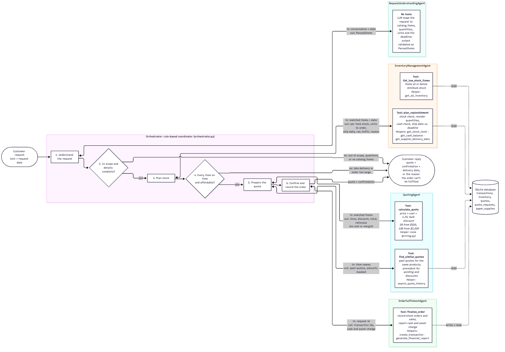

# Architecture and Validation

This workflow turns customer messages into validated requests, availability checks, quotes, and recorded orders. A Python orchestrator coordinates four model-backed workers: request understanding, inventory planning, quoting, and fulfillment. The included data models a simulated paper-supply business.

The design keeps language interpretation separate from financial calculations. Catalog fields are validated against the initialized database, while stock, quantities, prices, and ledger changes are calculated by Python functions.



The editable source is [agent_workflow_diagram.mmd](agent_workflow_diagram.mmd). See [README.md](README.md) for setup and runnable examples.

## Running modes and configuration

Run commands from the repository root using Python 3.12 or later.

| Mode | Command | Behavior |
|---|---|---|
| Saved preview | `python3 demo.py` | Reads the request and result CSVs and displays request 10. No model call, dependency installation, or database initialization. |
| Other saved outcomes | `python3 demo.py --case clarification` or `--case deadline` | Displays saved request 3 or 13 with its original input and response. |
| New single request | `uv run python demo.py --live --request "..." --date 2025-04-01` | Calls the model with `auto_confirm=False`; initializes the database only if it is absent. A feasible request returns a quote without recording a sale. |
| Full sample workflow | `uv run python operations.py` | Resets the database, calls the model for the sample requests, automatically accepts feasible orders, and overwrites `test_results.csv`. |

The saved preview uses only the Python standard library. Its output is a view of existing records, not a new execution of the agents. Live and batch modes need the project dependencies and model API access:

```sh
uv sync --locked
cp .env.example .env
```

Set `OPENAI_API_KEY` in the local `.env` file. `OPENAI_BASE_URL` is optional for a custom OpenAI-compatible endpoint. `model_config.py` uses `OPENAI_MODEL` when it is nonempty and otherwise defaults to `gpt-5.6-luna`; it also sends `reasoning_effort="none"`. Choose a model and endpoint that support tool calling and this configuration. The default model identifier is not assumed to work with every provider.

`demo.py --live` leaves an existing database in place. It does not migrate or reset an incompatible database. The batch runner always restores the seed state. Both modes use your provider's API allowance.

## Programmatic use

Initialize the database before importing the agent modules: `request_schema.py` reads the catalog at import time. This example creates a missing database, then requests a quote without recording an order:

```python
from pathlib import Path
from operations import db_engine, init_database

if not Path("munder_difflin.db").exists():
    init_database(db_engine)

from model_config import create_model
from orchestrator import Orchestrator

workflow = Orchestrator(model=create_model(), auto_confirm=False)
workflow.start_conversation()
result = workflow.process_customer_message(
    "Please quote 100 sheets of A4 paper, delivered by April 15, 2025.",
    request_date="2025-04-01",
    request_id=1,
)
print(result["status"])
print(result["reply"])
```

Use a unique request identifier for each order and call `start_conversation()` for a new customer. For follow-up messages from the same customer, keep the conversation and request identifier. After accepting a returned quote, a caller can explicitly invoke `workflow.confirm(request_id=1, order_date="2025-04-01")`. A customer's “yes” is not handled by a separate automatic confirmation branch. See [confirmation and ledger writes](#confirmation-and-ledger-writes) before implementing retries.

Calling `init_database(db_engine)` explicitly replaces existing tables, even when the database file already exists.

## Repository guide

| File | Purpose |
|---|---|
| `demo.py` | Dependency-free saved preview and optional live, quote-only command. |
| `operations.py` | Catalog, database setup, inventory and ledger helpers, and batch scenario runner. |
| `model_config.py` | Shared model construction and environment configuration. |
| `request_schema.py` | Catalog-backed request models and validation; reads the database on import. |
| `request_understanding_agent.py` | Conversation interpretation and structured request extraction. |
| `inventory_management_agent.py` | Stock, cash, replenishment, and lead-time planning tools. |
| `pricing.py` | Unit normalization, quantity conversion, and numeric quote calculations. |
| `quoting_agent.py` | Customer quote wording and historical quote lookup. |
| `order_fulfillment_agent.py` | In-memory accepted orders and ledger recording. |
| `orchestrator.py` | Conversation state, workflow decisions, and worker coordination. |
| `quote_requests.csv` / `quotes.csv` | Historical request and quote data loaded into SQLite. |
| `quote_requests_sample.csv` | Sample batch inputs and the original requests shown by the preview. |
| `test_results.csv` | Saved statuses, responses, and balance snapshots; overwritten by the batch runner. |
| `pyproject.toml` / `uv.lock` | Python requirements, dependencies, and locked environment. |
| `.env.example` | Placeholder API configuration; copy to the ignored local `.env` file. |
| `.gitignore` | Excludes credentials, local environments, bytecode, and generated databases. |
| `README.md` / `architecture.md` | Project overview, runnable examples, design decisions, and known limits. |
| `agent_workflow_diagram.mmd` / `.png` | Editable workflow diagram and rendered image. |
| `munder_difflin.db` | Generated local database, excluded from version control. |

## Components

| Component | Responsibility | Tools and dependencies |
|---|---|---|
| `Orchestrator` | Maintains conversation state, chooses workflow branches, delegates work, and assembles the customer reply. | Calls worker agents and deterministic pricing; stores quotes and plans in memory. |
| `RequestUnderstandingAgent` | Converts the conversation into a validated `ParsedItems` request: scope, products, quantities, units, missing information, and deadline. | No tools; catalog mapping and request schema are included in its instructions. |
| `InventoryManagementAgent` | Plans stock and replenishment against cash and delivery constraints. | `plan_replenishment`, `list_low_stock_items`; inventory, cash, and supplier-date helpers in `operations.py`. |
| `QuotingAgent` | Drafts the customer quote from calculated prices and optional historical wording references. | `calculate_quote`, `find_similar_quotes`; pricing policy and historical lookup. |
| `OrderFulfillmentAgent` | Records accepted stock orders and sales, then reports financial changes. | `finalize_order`; transaction creation and financial reporting in `operations.py`. |

The inventory worker plans without writing transactions. The quoting worker has no transaction tool. The fulfillment worker reads its quantities, prices, and date from a stored accepted order rather than model-supplied financial arguments.

## Request flow

1. **Interpret the conversation.** The orchestrator supplies conversation history and an explicit request date. The request worker returns structured data, which is validated before later stages use it.
2. **Resolve scope and missing details.** Unrelated requests receive a scope reply. Missing products, quantities, units, or dates trigger clarification. All current questions are collected in one reply.
3. **Plan catalog items.** Unavailable products are named in the reply; matched products proceed to stock, cash, replenishment, and deadline checks.
4. **Check feasibility.** If any matched item misses the shared deadline or required replenishment exceeds available cash, the order is declined. Late items are reported with their estimated earliest dates.
5. **Prepare a quote.** `price_quote` builds the authoritative numeric quote held by the orchestrator. The quoting worker uses its pricing tool to draft customer-facing text.
6. **Review or record.** With `auto_confirm=False`, the workflow returns `quoted`. With automatic confirmation enabled, or an explicit `confirm(...)` call, fulfillment records transactions and the orchestrator checks the reported asset change.

`start_conversation()` clears the conversation for a new customer. It does not clear previously stored orders. The sample runner uses separate conversations and unique request identifiers for each input row.

## Data and state

`operations.init_database` seeds the local SQLite database from the catalog and CSV files. It replaces the existing tables, initializes $50,000 of assets, and records the seed inventory purchases. The default inventory seed is 137.

| Table or state | Contents |
|---|---|
| SQLite `paper_supplies` | Catalog names, categories, unit costs, and minimum stock levels. |
| SQLite `inventory` | Inventory reference rows used for valuation and stock reporting. |
| SQLite `transactions` | Stock purchase and sale entries used to calculate stock and cash. |
| SQLite `quote_requests` / `quotes` | Historical request and quote data used for lookup. |
| Orchestrator `conversation` | Customer and assistant messages for the current conversation. |
| Orchestrator `orders` | Per-request plans, calculated quotes, delivery estimates, and financial results. |
| Fulfillment `confirmed_orders` | Accepted orders and recorded transaction identifiers, held in process memory. |

The database must be initialized before importing `request_schema.py`, which reads the catalog on import. Run the project from its repository root so the ledger helpers and the schema refer to the same local database.

## Example business rules

The rules below belong to the included supply-order example. Other order-processing domains would use their own catalog, units, pricing, and fulfillment constraints.

### Quantities and catalog validation

Matched items must use a catalog name with the exact category, unit cost, and minimum stock level. Unknown or ambiguous products remain unpriced until clarified. The parsing worker is instructed to leave current stock unset; inventory tools obtain stock from the ledger.

Quantity conversion normalizes supported counting units and uses explicit package contents when available. A ream defaults to 500 sheets unless explicit contents are supplied. Unknown box or pack sizes require clarification rather than an inferred conversion. Repeated product lines are combined after conversion to catalog units.

### Inventory and lead times

- Replenishment is considered when the requested order would leave stock below its minimum level.
- If existing stock covers the order, the target is three times the minimum. The order can use stock immediately.
- If the customer needs a shortfall replenished, the target is the minimum level. The delivery estimate uses the shortfall quantity; the additional buffer does not extend that estimate.
- Required shortfall purchases must fit available cash. An additional buffer is purchased only when cash also covers it.
- Every matched item must satisfy the shared deadline for the order to proceed.

Supplier lead times are fixed simulation rules in `operations.py`: same day for up to 10 units, one day for 11–100 units, four days for 101–1,000 units, and seven days above 1,000 units. The returned date is used as the workflow’s delivery estimate.

### Pricing and historical lookup

Inventory is valued at catalog `unit_price`, so that field is treated as unit cost. List prices apply a 25% markup, with a 5% discount from a $500 subtotal and a 10% discount from $2,000. Thresholds use the subtotal before discount. These are business assumptions defined in `pricing.py`; the maximum discount leaves a 12.5% markup before rounding.

Historical records are used for wording and discount context. Lookup skips nonpositive totals, removes duplicate explanations, and masks dollar amounts in the returned explanations. Historical totals do not determine new prices.

Only request text, quote explanation, amount, and date are returned by historical lookup. Customer roles and event descriptions in the source CSV metadata are not used for decisions. The request schema contains purchasing details without a customer-emotion classification.

## Workflow controls

### Numeric tool results and customer text

For inventory and fulfillment, `run_tool` reads the raw `ToolOutput` value from the agent’s streamed run. This lets workflow decisions use Python return values rather than the worker’s written summary. Inventory planning has a direct function fallback if no tool result is returned.

The quoting worker produces model-written customer text. Its instructions require the calculated quote amounts, but the returned text is not independently reconciled against the numeric quote stored by the orchestrator. Ledger entries use the stored numeric quote.

### Confirmation and ledger writes

`auto_confirm` defaults to `True` for the sample runner. Quote-only callers should explicitly pass `False` and call `confirm(...)` only after accepting the quote.

Fulfillment builds stock purchase entries before sale entries and records stock purchases first. A completed `finalize_order` call stores transaction identifiers and avoids another write if called again against that same unchanged accepted order. This guard has a narrow scope: `confirm_order` replaces the accepted order, including its guard state. Repeating `Orchestrator.confirm()` can therefore record the order again.

## Saved sample validation

[test_results.csv](test_results.csv) contains one date-ordered run of 20 requests from April 1–17, 2025. It records 12 fulfilled requests (1, 2, 4–12, and 20), seven deadline declines (13–19), one clarification (3), and no error statuses.

The fulfilled replies contain 32 quoted product lines totaling $4,170.64. The final recorded cash is $43,891.83 and inventory at catalog cost is $6,813.31, giving $50,705.14 of assets. Against the seeded $50,000, that is a $705.14 simulated increase before operating expenses, taxes, delivery charges, and model API costs. The CSV contains response and balance snapshots rather than a complete transaction audit log.

Observed examples show both useful behavior and remaining gaps:

- Request 8’s $900 subtotal receives a $45 bulk discount.
- Requests 9 and 20 name unavailable envelopes or tickets while continuing with matched catalog products.
- All seven declined requests identify late products and their earliest estimated dates.
- Request 2 classifies balloons as unrelated instead of naming an unavailable party product.
- Request 3 asks for clarification about “printer paper” rather than choosing a catalog default.

## Known limits

- **Model variability.** Parsing and quote wording can change across runs; the fixed Python decision sequence does not make every model result reproducible.
- **Order identity and retries.** Accepted orders and duplicate-write guards are held in memory. Reconfirmation can duplicate transactions, and there is no durable order identifier constraint or concurrency control.
- **Partial writes.** Transactions are written individually rather than as one atomic order. A failure can leave partial ledger entries; retrying can duplicate them.
- **Inventory timing.** Stock orders count as available on their order date. Arrival dates and in-transit inventory are not stored separately.
- **Delivery model.** Fixed supplier lead times are estimates; the system has no carrier integration, business-calendar adjustment, or separate shipping-time model.
- **Partial fulfillment.** The workflow can continue without unavailable catalog products, but it declines the entire matched order if any matched item is late. It does not split shipments or negotiate alternate dates automatically.
- **Request schema.** One shared deadline applies to all active items. Product ambiguity and unknown package sizes require clarification.
- **Customer quote consistency.** Generated quote wording has no final numeric reconciliation against the stored quote or ledger.
- **Application scope.** There is no persistent conversation store, authentication layer, or service interface. The workflow is a local simulation.

## 中文架构说明

系统由一个 Python 编排器和四个模型驱动的工作代理组成。请求代理将会话转换为结构化数据；库存代理检查库存、补货资金与期限；报价代理依据 Python 计算结果撰写客户报价；履约代理读取已接受订单并记录账目。

`python3 demo.py` 直接读取已有 CSV，展示原始请求与保存的回复；`demo.py --live` 调用模型并使用 `auto_confirm=False`，仅在数据库缺失时初始化；`operations.py` 会重置数据库并自动接受可履行的样例订单。模型由 `OPENAI_MODEL` 指定，未设置时使用配置中的默认值，需选择服务商支持的模型与参数。

通过 Python API 使用时，先初始化数据库，再导入代理模块。价格与账目使用确定性函数，但解析和报价文字可能变化。重复确认、逐条写入事务、在途库存和部分延迟发货仍是当前实现的限制。
